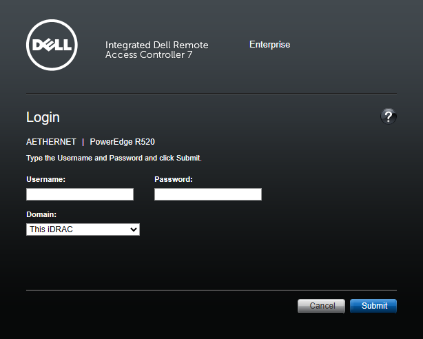
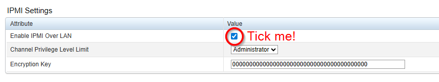

# Dell iDRAC Fan Controller (Docker)

I slept in 3 times in 2 weeks. So I did what any reasonable person would do: Built one of the most compute-heavy alarm clocks on the planet (As far as I know anyway...)

This is a fork of [Tigerblue77's original work](https://github.com/tigerblue77/Dell_iDRAC_fan_controller_Docker) -- They did the hard work of figuring out the IPMI raw commands to override Dell's aggressive fan curves. I bolted on an alarm clock feature: you set a time window and some hostnames to ping, and if those machines are offline when the window hits (i.e. you're still in bed), the fans ramp to 100%. They only shut up once your workstation responds to ping.

I run this across an R730xd (dev), R630 (lab), and R520 (NAS). All three scream at me simultaneously every morning. It works wonderfully aside from the self-inflicted tinnitus.

## Requirements

### iDRAC version

This only works on Dell PowerEdge servers that support IPMI commands, i.e. iDRAC firmware < 3.30.30.30 on iDRAC 9.
I've tested on:
- R730xD (BIOS: 2.19.0 - FIRMWARE: 2.85.85.85)
- R630 (BIOS: 2.19.0 - FIRMWARE: 2.85.85.85)
- R520 (BIOS: 2.9.0 - FIRMWARE: 2.65.65.65)
### Enabling IPMI over LAN

Not needed if you're running in "local" mode (container on the server itself). For LAN mode:

1. Log into your iDRAC web console



2. In the left menu, expand "iDRAC settings", click "Network", then click "IPMI Settings" at the top.


3. Check "Enable IPMI over LAN" and click "Apply".



4. Test it:
```bash
apt -y install ipmitool
ipmitool -I lanplus \
  -H <iDRAC IP address> \
  -U <iDRAC username> \
  -P <iDRAC password> \
  sdr elist all
```

## Supported architectures

Built for AMD64 and ARM64.

## Getting the image

Build locally:
```bash
docker build -t dxdeddy/dell_idrac_fan_controller:latest .
```

## Usage

For basic fan control without the alarm feature, see [Tigerblue77's upstream README](https://github.com/tigerblue77/Dell_iDRAC_fan_controller_Docker). The examples below focus on the alarm clock, which is the whole point of this fork.

### Docker Run

```bash
docker run -d \
  --name Dell_iDRAC_fan_controller \
  --restart=unless-stopped \
  -e IDRAC_HOST=192.168.1.100 \
  -e IDRAC_USERNAME=root \
  -e IDRAC_PASSWORD=calvin \
  -e FAN_SPEED=5 \
  -e CPU_TEMPERATURE_THRESHOLD=55 \
  -e CHECK_INTERVAL=15 \
  -e DISABLE_THIRD_PARTY_PCIE_CARD_DELL_DEFAULT_COOLING_RESPONSE=true \
  -e KEEP_THIRD_PARTY_PCIE_CARD_COOLING_RESPONSE_STATE_ON_EXIT=true \
  -e TZ=America/Chicago \
  -e ALARM_ENABLED=true \
  -e ALARM_CHECK_HOSTS=workpc.local \
  -e ALARM_HOST_LOGIC=any \
  -e ALARM_FAN_SPEED=100 \
  -e ALARM_PERSIST=false \
  -e ALARM_MAX_DURATION=60 \
  -e ALARM_1_START_TIME=08:58 \
  -e ALARM_1_END_TIME=09:00 \
  -e ALARM_1_DAYS=Mon,Wed,Thu,Fri \
  -e ALARM_2_START_TIME=06:29 \
  -e ALARM_2_END_TIME=06:30 \
  -e ALARM_2_DAYS=Tue \
  dxdeddy/dell_idrac_fan_controller:latest
```

### Docker Compose

See `docker-compose.example.yml` for a full working config, but here's the gist:

```yml
services:
  Dell_iDRAC_fan_controller:
    build: .
    image: dxdeddy/dell_idrac_fan_controller:latest
    container_name: Dell_iDRAC_fan_controller
    restart: unless-stopped
    environment:
      - IDRAC_HOST=192.168.1.100
      - IDRAC_USERNAME=root
      - IDRAC_PASSWORD=${IDRAC_PASSWORD}
      - FAN_SPEED=5
      - CPU_TEMPERATURE_THRESHOLD=55
      - CHECK_INTERVAL=15
      - DISABLE_THIRD_PARTY_PCIE_CARD_DELL_DEFAULT_COOLING_RESPONSE=true
      - KEEP_THIRD_PARTY_PCIE_CARD_COOLING_RESPONSE_STATE_ON_EXIT=true
      - TZ=America/Chicago
      # Alarm clock
      - ALARM_ENABLED=true
      - ALARM_CHECK_HOSTS=workpc.local
      - ALARM_HOST_LOGIC=any
      - ALARM_FAN_SPEED=100
      - ALARM_PERSIST=false
      - ALARM_MAX_DURATION=60
      # Weekday alarm
      - ALARM_1_START_TIME=08:55
      - ALARM_1_END_TIME=09:00
      - ALARM_1_DAYS=Mon,Wed,Thu,Fri
      # Early Tuesday
      - ALARM_2_START_TIME=06:29
      - ALARM_2_END_TIME=06:30
      - ALARM_2_DAYS=Tue
```

## Parameters

### Fan control

All parameters have defaults (including iDRAC credentials).

| Parameter | Description | Default |
|-----------|-------------|---------|
| `IDRAC_HOST` | `local` for on-box IPMI, or the iDRAC IP address for LAN mode | `local` |
| `IDRAC_USERNAME` | iDRAC username (LAN mode only) | `root` |
| `IDRAC_PASSWORD` | iDRAC password (LAN mode only) | `calvin` |
| `FAN_SPEED` | Target fan speed, decimal 0-100 or hexadecimal 0x00-0x64 | `5` (%) |
| `CPU_TEMPERATURE_THRESHOLD` | Above this temp the Dell default fan profile kicks in to protect hardware | `50` (C) |
| `CHECK_INTERVAL` | Seconds between each temperature check | `60` |
| `DISABLE_THIRD_PARTY_PCIE_CARD_DELL_DEFAULT_COOLING_RESPONSE` | Disable Dell's default cooling for third-party PCIe cards (Gen 13 and older) | `false` |
| `KEEP_THIRD_PARTY_PCIE_CARD_COOLING_RESPONSE_STATE_ON_EXIT` | Keep third-party PCIe card cooling state when the container stops (instead of resetting to Dell default) | `false` |

### Alarm clock

Set `ALARM_ENABLED=true` to use the alarm feature. You define numbered alarm schedules (`ALARM_1_*`, `ALARM_2_*`, `ALARM_3_*`, etc.) -- each one needs at least `START_TIME`, `END_TIME`, and `DAYS`. Everything else falls back to the shared `ALARM_*` defaults.

| Parameter | Description | Default |
|-----------|-------------|---------|
| `ALARM_ENABLED` | Master switch for the alarm feature | `false` |
| `ALARM_N_START_TIME` | When the alarm window opens (24h format, e.g. `08:58`) | *required* |
| `ALARM_N_END_TIME` | When the alarm window closes | *required* |
| `ALARM_N_DAYS` | Comma-separated days (`Mon,Tue,Wed`...) or `*` for every day | *required* |
| `ALARM_CHECK_HOSTS` | Comma-separated hostnames/IPs to ping for dismissal | `workpc.local` |
| `ALARM_HOST_LOGIC` | `any` = one host online dismisses, `all` = every host must be online | `any` |
| `ALARM_FAN_SPEED` | Fan speed during alarm (0-100) | `100` |
| `ALARM_PERSIST` | Keep the alarm going after the window closes (until dismissed or timed out) | `false` |
| `ALARM_MAX_DURATION` | Max alarm duration in minutes (only applies when `ALARM_PERSIST=true`) | `60` |
| `TZ` | Timezone for alarm scheduling (e.g. `America/Chicago`) | `UTC` |

Replace `N` with the alarm number (`1`, `2`, `3`...). Per-alarm values override the shared defaults.

The basic idea: every `CHECK_INTERVAL` seconds, if you're inside an alarm window, the controller pings `ALARM_CHECK_HOSTS`. Hosts offline? Fans go to `ALARM_FAN_SPEED`. Host comes back online (you got up and turned on your PC)? Fans drop back to normal. Each alarm fires once per day -- after dismissal or window expiry it won't re-trigger until tomorrow.

## Troubleshooting

If your server keeps switching back to the Dell default fan profile:

1. Look up `Tcase` (case temperature) for your CPU on Intel's Ark site, then set `CPU_TEMPERATURE_THRESHOLD` a bit below that. For example, my Intel Xeon E5-2630L v2 has a Tcase of 63C, so I set the threshold to 60.
2. If the threshold is already reasonable, bump up `FAN_SPEED` to push more air and keep temps down.
3. If neither helps, it might be time for new thermal paste.

## Contributing

PRs welcome. Fork it, make your changes, open a PR. Bugs and ideas go in [issues](https://github.com/DxDEddy/Dell_iDRAC_fan_controller_Docker/issues).

To test locally:
```bash
docker build -t dxdeddy/dell_idrac_fan_controller:dev .
docker run -d \
  --name Dell_iDRAC_fan_controller \
  -e IDRAC_HOST=<iDRAC IP> \
  -e IDRAC_USERNAME=root \
  -e IDRAC_PASSWORD=<password> \
  -e FAN_SPEED=5 \
  -e CPU_TEMPERATURE_THRESHOLD=50 \
  -e CHECK_INTERVAL=60 \
  dxdeddy/dell_idrac_fan_controller:dev
```

Or run the script directly:
```bash
export IDRAC_HOST=<iDRAC IP address>
export IDRAC_USERNAME=root
export IDRAC_PASSWORD=<password>
export FAN_SPEED=5
export CPU_TEMPERATURE_THRESHOLD=50
export CHECK_INTERVAL=60
export DISABLE_THIRD_PARTY_PCIE_CARD_DELL_DEFAULT_COOLING_RESPONSE=false
export KEEP_THIRD_PARTY_PCIE_CARD_COOLING_RESPONSE_STATE_ON_EXIT=false

chmod +x Dell_iDRAC_fan_controller.sh
./Dell_iDRAC_fan_controller.sh
```

## License

[![CC BY-NC-SA 4.0][cc-by-nc-sa-shield]][cc-by-nc-sa]

This work is licensed under a [Creative Commons Attribution-NonCommercial-ShareAlike 4.0 International License][cc-by-nc-sa]. Full text [here](./LICENSE).

[cc-by-nc-sa]: http://creativecommons.org/licenses/by-nc-sa/4.0/
[cc-by-nc-sa-shield]: https://img.shields.io/badge/License-CC%20BY--NC--SA%204.0-lightgrey.svg
